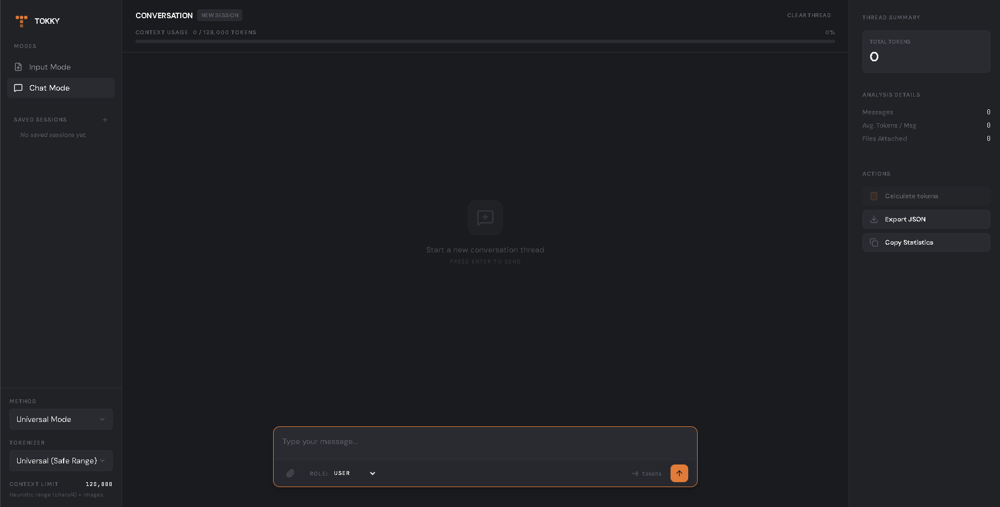

# Tokky (Token Counter)



A Flask web app to estimate AI token usage for documents and simulated conversations before sending them to large language models (LLMs).

## Features

- **Two modes:**
  - **Input Mode** — Upload files and get per-file token estimates
  - **Chat Mode** — Build a simulated conversation (user + assistant messages, text & file attachments), then count total tokens when done
- **Broad format support** — PDF, PPTX, plain text, Markdown, HTML, JSON, CSV, XML, YAML, source code, and images
- **Image-aware counting** — Extracts and counts significant images from PDF and PPTX (with deduplication)
- **Multiple Methods:**
  - **Universal Mode** — Heuristic token range (safe estimate across various models)
  - **BPE** — Byte Pair Encoding via `tiktoken` (`cl100k_base`, `o200k_base`, etc.)
- **Context window tracking** — Shows usage percentage against each tokenizer's context limit with warnings
- **Session Management** — Persists chat sessions using localStorage for continuity

## Modes

### Input Mode (`/input`)

Upload one or more files and click **Analyze Tokens**. Results show a breakdown per file plus total usage.

### Chat Mode (`/chat`)

Simulate a full conversation thread (layout: User right, AI left):

1. Type in the **Chat Field** — role alternates automatically (User → AI → User → …)
2. Press **Enter** to attach the message (Shift+Enter for new line)
3. Use **upload** to attach files per message
4. When finished, click **Calculate** at the bottom

Both roles support text and file uploads (e.g. user uploads a PDF, AI "returns" a generated file).

## Supported File Types

| Category | Extensions |
|----------|------------|
| Documents | `.pdf`, `.pptx` |
| Text & markup | `.txt`, `.md`, `.html`, `.htm` |
| Data | `.json`, `.csv`, `.xml`, `.yaml`, `.yml` |
| Source code | `.py`, `.js`, `.ts`, `.jsx`, `.tsx`, `.c`, `.cpp`, `.h`, `.hpp`, `.java`, `.go`, `.rb`, `.php`, `.sql` |
| Images | `.png`, `.jpg`, `.jpeg`, `.webp` |

## Supported Methods & Tokenizers

| Method | Tokenizers | Context Limit |
|----------|--------|---------------|
| Universal | Safe Range (heuristic) | 128K |
| BPE | cl100k_base, o200k_base, p50k_base, r50k_base | 8K – 128K |

## Requirements

- Python 3.8+
- Dependencies listed in `requirements.txt`

## Installation

1. Clone or download this repository:

   ```bash
   git clone https://github.com/Nopals-sub/Tokky.git
   cd Tokky
   ```

2. Create and activate a virtual environment (recommended):

   ```bash
   python -m venv venv

   # Windows
   venv\Scripts\activate

   # macOS / Linux
   source venv/bin/activate
   ```

3. Install dependencies:

   ```bash
   pip install -r requirements.txt
   ```

## Usage

Start the Flask app:

```bash
python app.py
```

Or:

```bash
flask --app app run
```

Open `http://localhost:5050` in your browser.

1. Select a **Method** and **Tokenizer** in the sidebar
2. Switch between **Input Mode** and **Chat Mode**
3. Add your content and run the analysis / count

## How Token Counting Works

### Text

- **Universal Mode** — Estimates a min/max range using character heuristics (1 token ≈ 2.5–5.5 characters)
- **BPE** — Uses `tiktoken` Byte Pair Encoding with the selected encoding (e.g. `cl100k_base` for GPT-4 class models)

### Chat Mode

Each message is counted with a `[role]` prefix plus its text and extracted file content. Totals are summed across the full conversation.

### Images

- **PDF** — Extracts images larger than 100×100 px, deduplicated by xref
- **PPTX** — Extracts images larger than 0.5 inches, deduplicated by blob hash
- **Standalone images** — Counted as 1 image each
- **Token cost** — ~1,000 tokens per image (conservative vision model estimate)

## Project Structure

```
Tokky/
├── app.py              # Flask app & API routes
├── config.py           # Providers, models, allowed extensions
├── services.py         # File & conversation analysis logic
├── extractor.py        # File content & image extraction
├── counter.py          # Token counting logic
├── templates/
│   ├── base.html       # Layout & sidebar
│   ├── input.html      # Input mode page
│   └── chat.html       # Chat mode page
├── static/
│   ├── css/style.css
│   ├── img/
│   │   ├── logo.svg    # App branding
│   │   └── Tokky.png   # App snapshot
│   └── js/
│       ├── common.js   # Settings & results rendering
│       ├── input.js    # Input mode logic
│       └── chat.js     # Chat mode logic
└── requirements.txt
```

## API Endpoints

| Method | Path | Description |
|--------|------|-------------|
| `GET` | `/` | Input mode (default) |
| `GET` | `/input` | Input mode |
| `GET` | `/chat` | Chat mode |
| `POST` | `/api/analyze/files` | Analyze uploaded files |
| `POST` | `/api/analyze/chat` | Count tokens for a conversation |

## Limitations

- Token counts are **estimates** — actual usage may vary by model, prompt formatting, and API overhead
- Image token costs are approximations; real vision token usage depends on image resolution and model
- Very small images/icons in documents are filtered out to reduce noise
- Chat mode does not replicate exact API message formatting overhead (system prompts, tool calls, etc.)